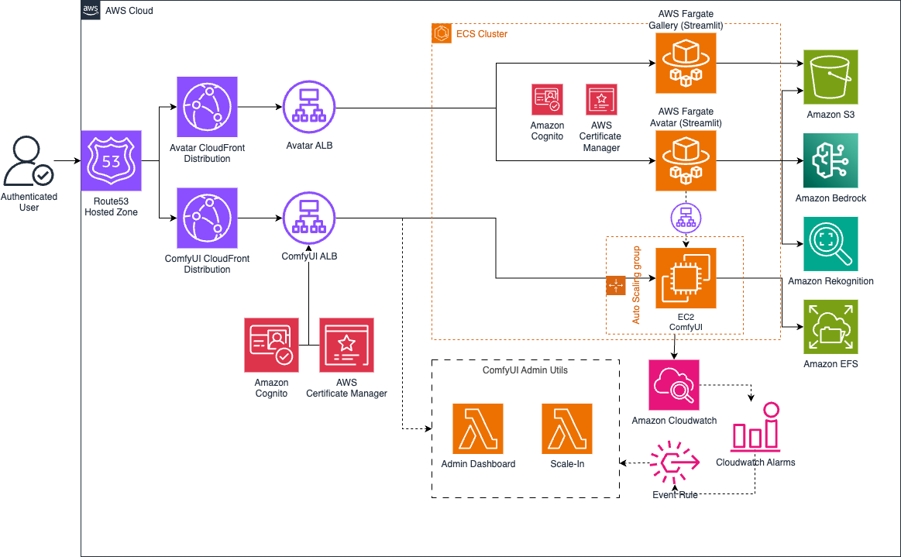

# ComfyUI on AWS with Optional Avatar App and Gallery


[](https://opensource.org/licenses/MIT)


This repository contains the infrastructure code and configuration to deploy a modular stack to AWS, featuring:
- `ComfyUI`: A powerful and modular stable diffusion GUI and backend
- `Avatar App`: A streamlit application for avatar generation
- `Avatar Gallery`: A streamlit application for viewing and managing generated avatars

💡 Note: This solution will incur AWS costs. Please refer to the [Cost Considerations](#cost-considerations) section for more information.

## Table of Contents
- [Architecture Overview](#architecture-overview)
- [Services](#services)
- [Deployment Types](#deployment-types)
- [Prerequisites](#prerequisites)
- [Getting Started](#getting-started)
  - [Setting Up the Environment](#setting-up-the-environment)
  - [Building and Pushing Docker Images](#building-and-pushing-docker-images)
  - [Deploying the Stack](#deploying-the-stack)
- [Accessing the Application](#accessing-the-application)
- [Included Setup](#following-setup-is-included)
  - [ComfyUI personalized avatar workflow](#comfyui-personalized-avatar-workflow)
  - [Avatar App look and feel](#avatar-app-look-and-feel)
  - [Avatar Gallery look and feel](#avatar-gallery-look-and-feel)
- [Uploading Models](#uploading-models)
- [Cost Considerations](#cost-considerations)
- [Cleanup](#cleanup)
- [Security](#security)
- [Authors](#authors)
- [Contributors](#contributors)
- [License](#license)
- [Acknowledgements](#acknowledgements)
- [Related Projects](#related-projects)

## Architecture Overview





## Services

This stack leverages several AWS services to create a scalable and secure architecture:

- **[Amazon VPC](https://docs.aws.amazon.com/vpc/latest/userguide/what-is-amazon-vpc.html)**: Provides isolated network infrastructure
- **[Amazon ECS](https://docs.aws.amazon.com/AmazonECS/latest/developerguide/Welcome.html)**: Manages containerized applications
- **[Amazon EC2 Auto Scaling](https://docs.aws.amazon.com/autoscaling/ec2/userguide/what-is-amazon-ec2-auto-scaling.html)**: Dynamically adjusts compute capacity
- **[Amazon ECR](https://docs.aws.amazon.com/AmazonECR/latest/userguide/what-is-ecr.html)**: Stores Docker images
- **[Elastic Load Balancing](https://docs.aws.amazon.com/elasticloadbalancing/latest/application/introduction.html)**: Distributes incoming application traffic
- **[Amazon S3](https://docs.aws.amazon.com/AmazonS3/latest/userguide/Welcome.html)**: Stores logs and serves as storage for Avatar App and Gallery
- **[Amazon CloudWatch](https://docs.aws.amazon.com/AmazonCloudWatch/latest/monitoring/WhatIsCloudWatch.html)**: Monitors and logs application metrics
- **[Amazon Cognito](https://docs.aws.amazon.com/cognito/latest/developerguide/what-is-amazon-cognito.html)**: Manages user authentication
- **[AWS Lambda](https://docs.aws.amazon.com/lambda/latest/dg/welcome.html)**: Provides utility functions for managing the stack
- **[Amazon CloudFront](https://docs.aws.amazon.com/AmazonCloudFront/latest/DeveloperGuide/Introduction.html)**: Delivers content with low latency
- **[Amazon Route 53](https://docs.aws.amazon.com/Route53/latest/DeveloperGuide/Welcome.html)**: Manages DNS routing
- **[AWS Certificate Manager](https://docs.aws.amazon.com/acm/latest/userguide/acm-overview.html)**: Provisions and manages SSL/TLS certificates

## Deployment Types

This stack supports three deployment configurations:

1. **`ComfyUI`**: Deploys only the ComfyUI service
2. **`ComfyUIWithAvatarApp`**: Deploys ComfyUI and the Avatar App
3. **`FullStack`**: Deploys ComfyUI, Avatar App, and Avatar Gallery (default)

## Prerequisites

Before deploying this stack, ensure you have:

1. An AWS account with necessary permissions
2. AWS CLI installed and configured
3. Node.js and npm installed
4. AWS CDK installed (`npm install -g aws-cdk`)
5. Docker installed (for building and pushing images to ECR)
6. Python 3.10+ installed
7. The following environment variables set up inside `set_variables.sh`:
   - `AWS_DEFAULT_REGION`: Your preferred AWS region (e.g. `us-east-1`)
   - `AWS_DEFAULT_ACCOUNT`: Your AWS account ID (e.g. `123456789012`)
   - `CERTIFICATE_ARN`: ARN of your SSL/TLS certificate in ACM (e.g. `arn:aws:acm:us-east-1:123456789012:certificate/235d130c-fb1e-467d-9b5e-f22d5c2f4cfb` NB it must be issued in `us-east-1` irrespectively of `AWS_DEFAULT_REGION`)
   - `CLOUDFRONT_PREFIX_LIST_ID`: CloudFront prefix list ID (e.g. `pl-3b927c52`,  cfr [this blog](https://aws.amazon.com/blogs/networking-and-content-delivery/limit-access-to-your-origins-using-the-aws-managed-prefix-list-for-amazon-cloudfront/))
   - `HOSTED_ZONE_ID`: Your Route 53 hosted zone ID (can be retrieved with the command `aws route53 list-hosted-zones-by-name`)
   - `ZONE_NAME`: Your domain name (e.g. `example.com`)
   - `RECORD_NAME_COMFYUI`: Subdomain for ComfyUI (e.g. `comfyui.example.com`)
   - `RECORD_NAME_AVATAR_APP`: Subdomain for Avatar App (e.g. `avatar-app.example.com`, required for ComfyUIWithAvatarApp and FullStack deployments)
   - `RECORD_NAME_AVATAR_GALLERY`: Subdomain for Avatar Gallery (e.g. `avatar-gallery.example.com`, required for FullStack deployment)
8. A valid SSL/TLS certificate for your domain in AWS Certificate Manager
9. A Route 53 hosted zone for your domain
10. Service Quotas increased for VPC: Inbound or outbound rules per security group to eg. `150`. Because the CloudFront Prefix list consumes approx. 60 rules (see: [Limit access to your origins using the AWS-managed prefix list for Amazon CloudFront](https://aws.amazon.com/de/blogs/networking-and-content-delivery/limit-access-to-your-origins-using-the-aws-managed-prefix-list-for-amazon-cloudfront/))

Ensure all these prerequisites are met before proceeding with the deployment.

## Getting Started

### Setting Up the Environment

1. Clone this repository:
   ```
   git clone https://github.com/aws-samples/comfyui-personalized-generative-ai-avatars-app.git
   cd comfyui-personalized-generative-ai-avatars-app
   ```

2. Install dependencies:
   ```
   npm install
   ```

3. Edit all the required environment variables inside `set_variables.sh` and source the script to set them:
   ```bash
   source set_variables.sh
   ```


### Building and Pushing Docker Images

1. Create ECR repositories:
   ```bash
   aws ecr create-repository --repository-name comfyui --image-scanning-configuration scanOnPush=true
   aws ecr create-repository --repository-name comfyui-avatar-app --image-scanning-configuration scanOnPush=true
   aws ecr create-repository --repository-name comfyui-avatar-gallery --image-scanning-configuration scanOnPush=true
   ```

2. Login to ECR:
   ```bash
   aws ecr get-login-password --region $AWS_DEFAULT_REGION | docker login --username AWS --password-stdin $AWS_DEFAULT_ACCOUNT.dkr.ecr.$AWS_DEFAULT_REGION.amazonaws.com
   ```

3. Build, tag, and push Docker images:  
ℹ️ Note for Apple Silicon (M1, M2, etc.) users: When building Docker images, use the --platform flag to ensure compatibility:
   ```bash
    # For ComfyUI
    docker build --platform linux/amd64 -t comfyui .
    docker tag comfyui:latest $AWS_DEFAULT_ACCOUNT.dkr.ecr.$AWS_DEFAULT_REGION.amazonaws.com/comfyui:latest
    docker push $AWS_DEFAULT_ACCOUNT.dkr.ecr.$AWS_DEFAULT_REGION.amazonaws.com/comfyui:latest

    # For Avatar App
    docker build --platform linux/amd64 -t comfyui-avatar-app ./comfyui_avatar_app
    docker tag comfyui-avatar-app:latest $AWS_DEFAULT_ACCOUNT.dkr.ecr.$AWS_DEFAULT_REGION.amazonaws.com/comfyui-avatar-app:latest
    docker push $AWS_DEFAULT_ACCOUNT.dkr.ecr.$AWS_DEFAULT_REGION.amazonaws.com/comfyui-avatar-app:latest

    # For Avatar Gallery
    docker build --platform linux/amd64 -t comfyui-avatar-gallery ./comfyui_avatar_gallery
    docker tag comfyui-avatar-gallery:latest $AWS_DEFAULT_ACCOUNT.dkr.ecr.$AWS_DEFAULT_REGION.amazonaws.com/comfyui-avatar-gallery:latest
    docker push $AWS_DEFAULT_ACCOUNT.dkr.ecr.$AWS_DEFAULT_REGION.amazonaws.com/comfyui-avatar-gallery:latest
   ```
   For users not on Apple Silicon, you can omit the `--platform linux/amd64` flag.


### Deploying the Stack

1. Install the required python libraries
   ```bash
   pip install -r requirements.txt
   ```

2. Bootstrap CDK (if not done before in this account/region):
   ```bash
   cdk bootstrap
   ```

3. Deploy the stack corresponding to the needs:
   ```bash
   # For full stack deployment (DEFAULT)
   cdk deploy # --no-rollback
   ```

   ```bash
   # For ComfyUI only
   cdk deploy -c DeploymentType=ComfyUI
   ```

   ```bash
   # For ComfyUI with Avatar App
   cdk deploy -c DeploymentType=ComfyUIWithAvatarApp
   ```

## Accessing the Application

After deployment, you can access the applications using the URLs specified inside `set_variables.sh`.

For ComfyUI: `https://<your-comfyui-subdomain>.<your-domain>`  
For Avatar App (if deployed): `https://<your-avatar-app-subdomain>.<your-domain>`  
For Avatar Gallery (if deployed): `https://<your-avatar-gallery-subdomain>.<your-domain>`  
  

## Some Details on the deployed stack

### ComfyUI personalized avatar workflow

*workflow included in png.  

The relevant models, custom_nodes, lora, clipvision and face restore models are installed with the `startup.sh` script automatically. 
### Avatar App look and feel (it's a video)
[](media/avatar-app-ux.mp4)

Application Features:
- File Upload component
    - on mobile: photos can be choosen from gallery or depending on OS / Manufacturer also directly taken from the camera
    - on desktop: the user is able to upload files from their file system. Webcam feature is coded, but commented out per default.
- Amazon Rekognition integrated for face detection. If user doesn't upload an image with a face, then the options of generating an avatar are not available.
- Describe Image: Invokes Amazon Bedrock with Anthropic Haiku LLM to describe the uploaded image
- Customization options:
    - Presets provided for Sci-fi heros, EURO 2024 soccer players and other Sports characters
    - Customization options for influencing Avatar outputs (gender, hair length an color, skine tone, face expression)
- Image Share button for sharing avatars to Avatar Gallery (see below)
- Amazon Rekognition integrated for moderating output images, i.e. no Image is shown to the user if containing nudity, drugs, violence.
- Avg. Avatar generation takes 4-7 seconds.

### Avatar Gallery look and feel


Application Features:
- Default implementation with dual login mode (admin and user) to provide control over shared content
   -  this option can be changed in the `avatar_gallery.py`
- Admin mode (setup through `cognito_post_deploy_fix.py`): 
   - access to all the images shared from users 
   - content moderation capability to accept or moderate images
- User mode: (setup directly in Amazon Cognito) 
   - Only access the images that are accepted from the admin
- Displayed login credentials and qr-code on the left sidebar for fast access from mobile device (must be updated according to your setup)

## Uploading Models

The provided installation uploads the required models and modules for the Avatar App to the persistent EBS volume used by the EC2 instance backing the ComfyUI container. The script [upload_models.sh](comfyui_config/upload_models.sh)  contains a helper snippet to upload a wider selection of additional models, loras and ComfyUI custom models. An example of how to access to the EC2 instance, the ComfyUI container and to download of the components is shown below:

1. Connect to the EC2 instance via SSM:
   ```bash
   aws ssm start-session --target "$(aws ec2 describe-instances --filters "Name=tag:Name,Values=ComfyUIStack/ASG" "Name=instance-state-name,Values=running" --query 'Reservations[*].Instances[*].[InstanceId]' --output text)" --region $AWS_DEFAULT_REGION
   ```

2. Access the ComfyUI container:
   ```bash
   container_id=$(sudo docker container ls --format '{{.ID}} {{.Image}}' | grep 'comfyui:latest$' | awk '{print $1}')
   sudo docker exec -it $container_id /bin/bash
   ```

3. Download and install your desired models. For example:
   ```bash
   wget -c https://huggingface.co/runwayml/stable-diffusion-v1-5/resolve/main/v1-5-pruned-emaonly.ckpt -O ./models/checkpoints/v1-5-pruned-emaonly.ckpt
   ```

## Cost Considerations

❗ The deployed application stack will incur costs. Feel free to visit [AWS-samples/cost-effective-aws-deployment-of-comfyui](https://github.com/aws-samples/cost-effective-aws-deployment-of-comfyui?tab=readme-ov-file#cost-considerations) to get an understanding about the cost structure. Services like CloudFront and Route53 are not included in the mentioned calculation.  
  
Use the [AWS Pricing Calculator](https://calculator.aws/) to estimate costs based on your expected usage.


## Cleanup

To avoid ongoing charges, delete the resources when no longer needed:

1. Manually delete the Auto Scaling Group from the AWS Console.
2. Run `cdk destroy` to remove the remaining resources.
3. Manually delete the EBS volume and Cognito User Pool from the AWS Console.
4. Delete the ECR repositories if no longer needed.

## Security

This project implements several security best practices:

- VPC with public and private subnets
- Security groups to control traffic
- SSL/TLS encryption for all public endpoints
- Cognito authentication for access control
- Several fine-grained IAM policies
- cdk-nag for IaC best practices

However, always review and adjust security settings for your specific use case.

## Authors
- [Pajtim Matoshi](https://www.linkedin.com/in/pmatoshi/)
- [Luca Perrozzi](https://www.linkedin.com/in/luca-perrozzi/)

## Contributors
Contributions to this project are welcome! Please refer to the [Contributing](CONTRIBUTING.md) file for guidelines.

Current contributors:  
[](https://github.com/aws-samples/comfyui-personalized-generative-ai-avatars-app/graphs/contributors)


## License

This library is licensed under the MIT-0 License. See the LICENSE file.

- [License](LICENSE) of the project.
- [Code of Conduct](CONTRIBUTING.md#code-of-conduct) of the project.
- [THIRD-PARTY](THIRD-PARTY) for more information about third party usage


## Acknowledgements

This project uses various open-source libraries and AWS services. Please see the [THIRD-PARTY](THIRD-PARTY) file for attributions.


## Related Projects

Here are some projects that are related to or complement this ComfyUI on AWS deployment:

1. [AWS-Samples/cost-effective-aws-deployment-of-comfyui](https://github.com/aws-samples/cost-effective-aws-deployment-of-comfyui): A cost-optimized deployment of ComfyUI on AWS.

2. [ComfyUI Official Repository](https://github.com/comfyanonymous/ComfyUI): The main ComfyUI project, which this deployment is partially based on.

3. [Streamlit](https://github.com/streamlit/streamlit): The framework used for building the Avatar App and Avatar Gallery interfaces.

4. [AWS CDK](https://github.com/aws/aws-cdk): The infrastructure as code framework used for deploying this solution.

These projects can provide additional context, alternative approaches, or complementary tools for working with generative AI on AWS.


